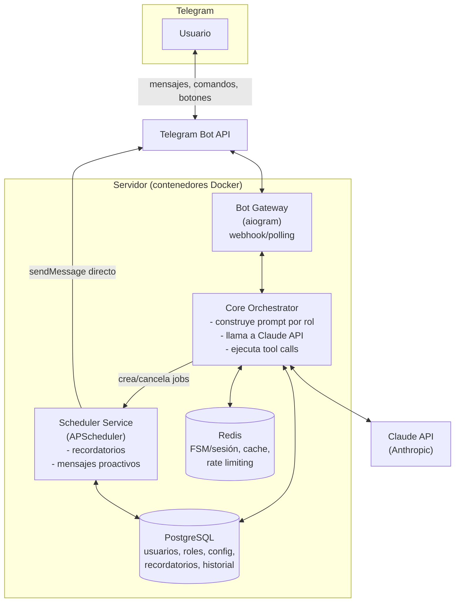

# Nexum — Planeación de Arquitectura

> Asistente personal proactivo sobre Telegram, con roles configurables (profesor de inglés, profesor de matemática, coach personal, y roles custom), recordatorios/eventos programados y mensajes automáticos, corriendo en contenedores sobre Python.

Este documento es la planeación paso a paso, desde cero, de la arquitectura de Nexum. Sirve como referencia viva del proyecto (`docs/ARCHITECTURE.md`) y se debe actualizar conforme el diseño evolucione.

---

## 0. Principios de diseño

1. **El servidor es el cerebro, Telegram es solo el canal.** La API de Telegram únicamente transporta mensajes; toda la personalización (rol activo, tono, memoria, recordatorios) vive en el servidor.
2. **Modular monolito antes que microservicios.** Un único codebase Python dividido en módulos claros (`bot`, `core`, `scheduler`, `db`), desplegado como varios contenedores desde la misma imagen. Se separa en servicios independientes solo cuando haya una razón medible (carga, escalado independiente).
3. **El LLM decide, el servidor ejecuta.** Las acciones con efecto (crear recordatorio, cambiar de rol, guardar una nota) se exponen al modelo como *tools* (function calling), nunca se le pide al modelo que "sepa" hacerlas por sí solo.
4. **Todo es configurable por datos, no por código.** Roles, prompts, periodicidad, recordatorios: filas en base de datos, no branches en Python.
5. **Diseño desde el día 1 para múltiples usuarios**, aunque el primer despliegue sea de un único usuario (el propio autor).

---

## 1. Alcance

### MVP (fase 1-3)
- Un usuario habla con el bot en lenguaje natural y recibe respuestas de un asistente de IA.
- El usuario puede elegir un **rol** (profesor de inglés / profesor de matemática / coach personal) mediante un menú de botones (`/rol`).
- Cada rol tiene un *system prompt* propio y un comportamiento distinto (p. ej. el profesor de inglés corrige gramática, ortografía y vocabulario en cada mensaje).
- El usuario puede pedir "recuérdame X" y el bot crea un recordatorio real que se dispara en el momento correcto, sin que el usuario tenga que estar conectado.

### V1 (fase 4-5)
- Mensajes proactivos configurables (check-ins diarios, resúmenes semanales, "¿practicamos inglés hoy?").
- Eventos con recordatorios derivados automáticamente (cita el jueves → recordatorio 1 día antes + 2 horas antes).
- Memoria de largo plazo (preferencias, nivel de inglés, objetivos del coaching) que persiste entre conversaciones.

### V2 (fase 6-7)
- Roles personalizados creados por el propio usuario.
- Multi-idioma, multi-timezone, multi-usuario a escala.
- Observabilidad completa y despliegue productivo robusto.

**Fuera de alcance inicial:** voz/audio, multi-tenant para terceros (SaaS), pagos.

---

## 2. Arquitectura de alto nivel



**Flujo resumido:** Telegram → Bot Gateway → Core Orchestrator (arma el prompt según rol + config del usuario, llama a Claude con *tools* habilitadas) → si el modelo pide una acción (crear recordatorio, cambiar rol, guardar nota), el Core la ejecuta contra la base de datos y, si aplica, registra un job en el Scheduler → la respuesta vuelve al usuario por Telegram. El Scheduler, cuando llega la hora de un recordatorio, envía el mensaje directamente vía la Telegram Bot API (no necesita pasar por el Bot Gateway).

---

## 3. Componentes y responsabilidades

| Componente | Responsabilidad | Notas técnicas |
|---|---|---|
| **Bot Gateway** | Recibe updates de Telegram (webhook), maneja comandos (`/start`, `/rol`, `/config`, `/recordatorios`), menús inline y máquina de estados de conversación (FSM) para flujos multi-paso. | `aiogram` 3.x (async, FSM nativo con `RedisStorage`) |
| **Core Orchestrator** | Carga contexto del usuario, construye el *system prompt* dinámico según el rol activo, llama a la API de Claude con las *tools* habilitadas, ejecuta las tools que el modelo invoque, persiste la conversación. | SDK oficial `anthropic` (Python) |
| **Scheduler Service** | Dispara recordatorios y mensajes automáticos programados; recalcula periodicidad; envía mensajes proactivos directamente vía Telegram Bot API. | `APScheduler` con `SQLAlchemyJobStore` sobre Postgres (persistente, sobrevive reinicios) |
| **PostgreSQL** | Fuente de verdad: usuarios, configuración, catálogo de roles, historial de conversación, recordatorios/eventos, auditoría de tool calls. | `SQLAlchemy 2.x` + `Alembic` para migraciones |
| **Redis** | Estado de FSM de Telegram, cache de sesión (último contexto cargado), rate limiting por usuario, cola opcional para desacoplar el webhook de trabajo pesado. | |
| **Claude API (Anthropic)** | Motor de IA: comprensión de lenguaje, generación de respuestas por rol, decisión de qué *tool* invocar. | Ver sección 6 |

---

## 4. Gestión de roles y personalización

### 4.1 Catálogo de roles
Los roles se modelan como **datos**, no como código:

```
roles
├── key                  (english_teacher | math_teacher | personal_coach | ...)
├── name                 (nombre visible en el menú)
├── system_prompt        (plantilla con variables: {user_name}, {level}, {tone}, ...)
├── enabled_tools         (lista de tools que el modelo puede usar en este rol)
└── config_schema         (qué parámetros son configurables: nivel, rigurosidad, foco)
```

Ejemplos de comportamiento por rol:
- **Profesor de inglés**: corrige gramática/ortografía/typos en cada mensaje del usuario, sugiere vocabulario, ajusta nivel (A1–C2), puede proponer mini-ejercicios diarios (vía mensaje proactivo).
- **Profesor de matemática**: resuelve/explica paso a paso, detecta el nivel del usuario, propone ejercicios de refuerzo.
- **Coach personal**: hace seguimiento de metas, agenda check-ins, detecta compromisos mencionados en la conversación ("tengo una cita el jueves") y los convierte en eventos/recordatorios reales.

### 4.2 Selección y configuración de rol (UX en Telegram)
- `/rol` → `InlineKeyboardMarkup` con un botón por rol → al seleccionar, se abre un sub-menú de configuración específico del rol (ej. nivel de inglés, tono formal/informal) implementado como una FSM de aiogram.
- `/config` → configuración global: zona horaria, idioma de la interfaz, periodicidad de mensajes proactivos (diario / cada N días / desactivado), horario preferido de check-in.
- El rol activo y su configuración quedan en `user_configs`, y se inyectan en el *system prompt* en cada llamada al modelo.

### 4.3 Cambio de rol por lenguaje natural (opcional, fase 2+)
Además del menú, se puede exponer una tool `set_active_role(role_key)` para que, si el usuario escribe "quiero practicar inglés", el propio modelo dispare el cambio de rol sin pasar por comandos.

---

## 5. Modelo de datos (esquema inicial)

```
users
  id, telegram_user_id (unique), username, first_name,
  language_code, timezone, created_at, is_active

user_configs
  user_id (FK), active_role_key, periodicity, preferred_checkin_time,
  extra_settings (JSONB)         -- parámetros específicos del rol activo

roles
  key (PK), name, system_prompt, enabled_tools (JSONB), config_schema (JSONB)

conversations
  id, user_id (FK), role_key, direction (in/out), content,
  tokens_used, created_at
  -- ventana deslizante + resumen periódico para no crecer indefinidamente

events
  id, user_id (FK), title, event_at (timestamptz), notes, created_at

reminders
  id, user_id (FK), event_id (FK, nullable), title, scheduled_at (timestamptz),
  recurrence_rule (RRULE, nullable), status (pending|sent|cancelled|failed),
  source (user_command|llm_tool_call), created_at

tool_call_audit
  id, user_id (FK), tool_name, input_json, result_json, created_at
```

**Notas:**
- `events` vs `reminders`: un evento (la cita) puede generar **varios** recordatorios (1 día antes, 2 horas antes), de ahí la separación.
- Todas las horas se guardan en UTC; se convierten usando el `timezone` (IANA, ej. `America/Bogota`) del usuario al mostrar/interpretar.
- `tool_call_audit` da trazabilidad de qué decidió el modelo y qué se ejecutó — clave para depurar y para confianza del usuario ("¿por qué me llegó esto?").

---

## 6. Integración con Claude API

### 6.1 Modelo
- **Recomendado por defecto: `claude-opus-5`** (máxima calidad de razonamiento; útil para tutoría real — corregir gramática con matices, explicar matemática paso a paso, coaching con contexto).
- Para optimizar costos una vez el bot tenga tráfico real, se puede *tierear* por tipo de tarea (evaluar con datos reales, no antes):
  - `claude-sonnet-5` — buen equilibrio costo/calidad para conversación general.
  - `claude-haiku-4-5` — tareas baratas de bajo riesgo (clasificar intención, respuestas muy cortas).
- Esto se decide después de medir uso real; no hay que optimizar prematuramente.

### 6.2 Function calling (tools) — el puente entre "hablar" y "hacer"
Cada rol expone un subconjunto de estas tools al modelo (vía la API `tools` de Claude):

| Tool | Uso |
|---|---|
| `create_reminder(title, scheduled_at \| relative_offset, recurrence?, notes?)` | Recordatorio simple |
| `create_event_with_reminders(title, event_at, reminder_offsets[])` | Ej: "tengo cita el jueves 3pm" → evento + recordatorios 1 día y 2 horas antes |
| `list_reminders()` / `cancel_reminder(id)` | Gestión desde el chat |
| `update_user_setting(key, value)` | Cambiar periodicidad, timezone, nivel, tono |
| `set_active_role(role_key)` | Cambio de rol por lenguaje natural |
| `save_memory(fact)` | Guardar una preferencia/dato relevante a largo plazo |

El **Core Orchestrator** implementa cada tool como una función Python real (escribe en Postgres, registra un job en el Scheduler, etc.) y usa el *tool runner* del SDK para el loop agente (llamar modelo → ejecutar tool → devolver resultado → repetir hasta respuesta final). Los resultados de tools fallidas se devuelven con `is_error: true`, nunca se descartan silenciosamente.

### 6.3 Prompt caching
El *system prompt* de cada rol es contenido estable y se reutiliza en cada turno del mismo usuario → candidato ideal para `cache_control` (ephemeral). Reduce significativamente el costo en conversaciones largas. Regla de oro: contenido estable (system prompt, definición de tools) primero, contenido variable (el mensaje del turno) al final.

### 6.4 Historial largo
Cuando una conversación crece mucho, usar **compactación** (resumen automático del historial antiguo) en vez de truncar sin más, para no perder contexto relevante (nivel del alumno, metas del coaching, etc.).

---

## 7. Recordatorios y mensajes proactivos

### 7.1 Ciclo de vida de un recordatorio
1. Se crea (por comando `/recordatorios`, o porque el LLM invocó `create_reminder`/`create_event_with_reminders`).
2. Se guarda en Postgres **y** se registra un job en APScheduler (`SQLAlchemyJobStore`, persistente — sobrevive a reinicios del contenedor).
3. Al disparar, el Scheduler llama directamente `sendMessage` de la Telegram Bot API (no depende de que el Bot Gateway esté "escuchando" en ese instante) y marca el recordatorio como `sent`.
4. Si es recurrente (`recurrence_rule`), se reprograma automáticamente.

### 7.2 Mensajes automáticos / periodicidad
- Configurable por usuario (`user_configs.periodicity`): diario, cada N días, días específicos, desactivado.
- Un job periódico del Scheduler evalúa a quién le toca un check-in y genera el mensaje (puede ser una llamada corta al LLM para que suene natural y contextual, no un template fijo, usando el rol activo del usuario).

### 7.3 Ejemplo end-to-end (coach personal)
> Usuario: "Tengo una cita con el dentista el jueves a las 3pm"

1. Core llama a Claude con el rol `personal_coach` activo.
2. El modelo detecta el compromiso y llama `create_event_with_reminders(title="Cita dentista", event_at="2026-09-11T15:00-05:00", reminder_offsets=["1d","2h"])`.
3. Core ejecuta la tool: inserta `events`, inserta 2 filas en `reminders` con `scheduled_at` calculado, registra 2 jobs en APScheduler.
4. El modelo responde al usuario confirmando.
5. El miércoles a las 3pm y el jueves a la 1pm, el Scheduler dispara sendMessage automáticamente: "📅 Recordatorio: mañana tienes tu cita con el dentista a las 3pm".

---

## 8. Infraestructura y contenedores

### 8.1 Servicios (docker-compose, desarrollo)

| Servicio | Imagen/base | Rol |
|---|---|---|
| `app` | Python (mismo código, `bot` + `core` en un proceso para el MVP) | Recibe updates de Telegram, orquesta LLM |
| `scheduler` | Mismo código, entrypoint distinto | Ejecuta APScheduler en proceso separado (evita duplicar jobs si `app` escala a >1 réplica) |
| `postgres` | `postgres:16` | Persistencia |
| `redis` | `redis:7` | FSM, cache, rate limiting |
| `caddy` / `nginx` (opcional) | — | TLS + reverse proxy para el webhook de Telegram (requiere HTTPS) |

Un único `Dockerfile` con múltiples *entrypoints* (`python -m nexum.bot`, `python -m nexum.scheduler`) mantiene una sola imagen para todo el proyecto — más simple de mantener que imágenes separadas mientras el proyecto es pequeño.

### 8.2 Desarrollo vs. producción
- **Dev:** `docker-compose.yml`, Telegram en modo *polling* (no requiere HTTPS ni dominio público), hot-reload.
- **Prod:** *webhook* con HTTPS (Telegram lo exige), validado con el header `X-Telegram-Bot-Api-Secret-Token`; `docker-compose.prod.yml` o migración a K8s/Swarm si el proyecto crece; backups automáticos de Postgres; réplicas del `app` (el `scheduler` se mantiene en 1 réplica para no duplicar recordatorios, o se migra a un lock distribuido si se necesita HA).

### 8.3 Gestión de secretos
`.env` fuera de git (ya cubierto por `.gitignore`), `ANTHROPIC_API_KEY` y `TELEGRAM_BOT_TOKEN` como variables de entorno inyectadas por el orquestador (Docker secrets / vault en prod, nunca hardcoded ni logueados).

---

## 9. Seguridad

- Validar el `secret_token` del webhook de Telegram en cada request.
- Rate limiting por `telegram_user_id` (Redis) — protege costos de LLM y evita abuso.
- Sanitizar/limitar longitud de inputs antes de mandarlos al modelo.
- No loguear contenido completo de conversaciones en nivel `INFO` (PII); logs estructurados con niveles claros.
- Least-privilege: credenciales de DB distintas para `app` y `scheduler` si se requiere aislar permisos.
- `tool_call_audit` como registro de todo lo que el modelo ejecutó con efectos reales.

---

## 10. Observabilidad (a partir de fase 6)

- Logging estructurado (`structlog`/`loguru`) con correlación por `user_id` + `request_id`.
- Métricas Prometheus: latencia de respuesta del LLM, tasa de error de tools, recordatorios disparados vs. fallidos.
- Sentry (o similar) para excepciones no controladas.
- Health checks por contenedor (`/healthz`) para orquestador y `docker-compose`/K8s.

---

## 11. Estructura de carpetas propuesta

```
nexum/
├── docker-compose.yml
├── docker-compose.prod.yml
├── Dockerfile
├── .env.example
├── pyproject.toml
├── alembic/                      # migraciones de DB
├── src/nexum/
│   ├── bot/                      # aiogram: handlers, keyboards, FSM
│   │   ├── handlers/
│   │   ├── keyboards/
│   │   └── middlewares/
│   ├── core/                     # orquestación LLM
│   │   ├── llm/
│   │   │   ├── client.py         # wrapper del SDK anthropic
│   │   │   ├── tools.py          # definición + ejecución de tools
│   │   │   └── roles/            # templates de system prompt por rol
│   │   └── services/
│   ├── scheduler/                # APScheduler, jobs de recordatorios
│   ├── db/
│   │   ├── models.py
│   │   └── repositories/
│   ├── config.py
│   └── main.py                   # entrypoints vía CLI/env
├── tests/
└── docs/
    └── ARCHITECTURE.md           # este documento
```

---

## 12. Stack tecnológico

| Capa | Elección | Motivo |
|---|---|---|
| Lenguaje | Python 3.12+ | Requisito del usuario |
| Bot framework | `aiogram` 3.x | Async nativo, FSM con Redis, inline keyboards de primera clase |
| LLM | Claude API (`anthropic` SDK) | Tool use robusto, prompt caching, modelos de alta calidad de razonamiento |
| ORM / migraciones | SQLAlchemy 2.x + Alembic | Estándar, tipado, migraciones versionadas |
| Base de datos | PostgreSQL 16 | Relacional, soporta JSONB para config flexible, `SQLAlchemyJobStore` para APScheduler |
| Cache / broker | Redis 7 | FSM, cache de contexto, rate limiting |
| Scheduler | APScheduler (`SQLAlchemyJobStore`) | Jobs dinámicos persistentes sin infraestructura adicional; migrar a Celery+beat solo si se necesita distribución real |
| Contenedores | Docker + docker-compose → K8s/Swarm (futuro) | Requisito del usuario |
| Reverse proxy/TLS | Caddy o Nginx | HTTPS obligatorio para webhook de Telegram en prod |
| Tests | pytest + pytest-asyncio | Estándar en el ecosistema async de Python |
| CI/CD | GitHub Actions | Integración directa con el repo |

---

## 13. Roadmap por fases

| Fase | Entregable |
|---|---|
| **0 — Fundamentos** | Repo, `pyproject.toml`, esqueleto Docker (`app`, `postgres`, `redis`), bot de Telegram registrado (BotFather), conexión "echo" mínima funcionando en polling. |
| **1 — MVP conversacional** | Core Orchestrator llamando a Claude API sin tools, un único rol genérico, historial guardado en Postgres. |
| **2 — Roles y personalización** | Catálogo de roles en DB, menú `/rol` con `InlineKeyboardMarkup`, system prompts dinámicos por rol, `/config` básico. |
| **3 — Tool use / recordatorios manuales** | Tools `create_reminder`, `list_reminders`, `cancel_reminder`; Scheduler con APScheduler + jobstore persistente; primer recordatorio disparado end-to-end. |
| **4 — Eventos y mensajes proactivos** | `create_event_with_reminders`, periodicidad configurable, check-ins automáticos generados por el LLM según rol. |
| **5 — Memoria de largo plazo** | `save_memory`, compactación de historial largo, resúmenes periódicos de contexto (nivel de inglés, metas de coaching). |
| **6 — Hardening** | Rate limiting, logging estructurado, tests automatizados, CI, Sentry. |
| **7 — Producción** | Webhook + HTTPS, backups de Postgres, despliegue en VPS/cloud, monitoreo (Prometheus/Grafana). |

---

## 14. Próximos pasos inmediatos

1. Confirmar estructura de carpetas y crear el esqueleto (`pyproject.toml`, `Dockerfile`, `docker-compose.yml`).
2. Registrar el bot en BotFather y guardar el token en `.env` (no versionado).
3. Levantar `postgres` + `redis` en `docker-compose.yml` y el primer modelo `users`/`roles` con Alembic.
4. Implementar el flujo "echo" en `aiogram` (polling) para validar el contenedor `app` de punta a punta.
5. Conectar el primer rol (`personal_coach`, sin tools todavía) a Claude API y validar una conversación real.
